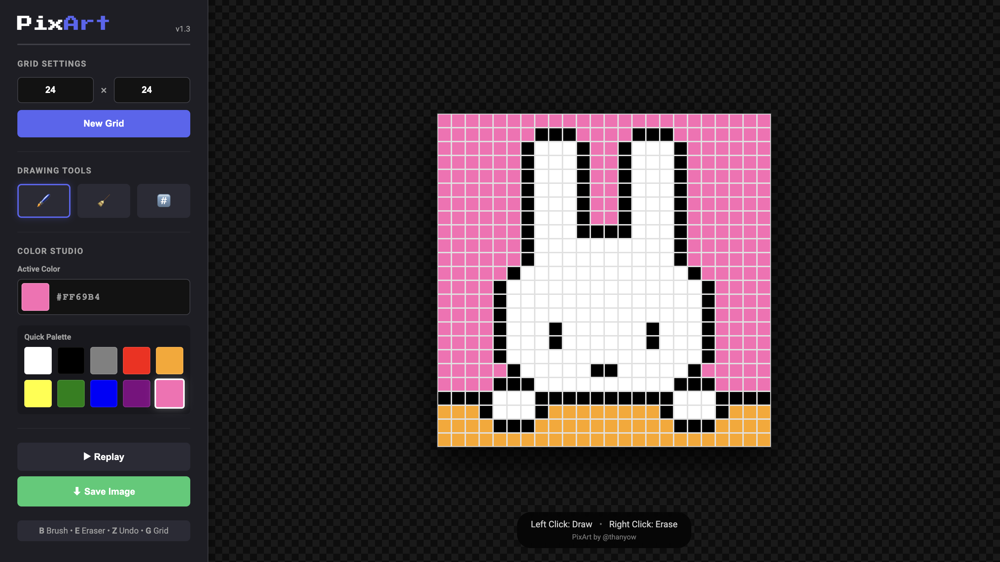

# PixArt 🎨

 

**PixArt** is a lightweight, feature-rich pixel art editor that runs entirely in your browser. It has tools like undo history, timelapse replays, and instant PNG export.

🔗 **[Live Demo](https://pix-art-niyo.vercel.app)**

## ✨ Features

* **Dynamic Canvas:** Create grids from 5x5 up to 50x50.
* **Smart Color Studio:**
    * Real-time Hex Code display.
    * Quick Palette with 10 essential colors.
    * Native Color Picker for custom shades.
* **Professional Tools:**
    * **Brush & Eraser:** Switch tools instantly.
    * **Grid Toggle:** Hide grid lines for a clean preview.
    * **Right-Click Erase:** Erase pixels without switching tools.
* **Time Travel:**
    * **Undo (Z):** Step back through your last 50 actions.
    * **Instant Replay:** Watch your artwork be drawn from start to finish.
* **Export:** Download your art as a high-quality PNG with a custom "Made with PixArt" polaroid frame.

## 🎮 Controls & Shortcuts

| Key | Action |
| :--- | :--- |
| **Left Click** | Draw / Paint |
| **Right Click** | Quick Erase |
| **B** | Switch to Brush |
| **E** | Switch to Eraser |
| **G** | Toggle Grid Lines |
| **Z** | Undo Last Action |

## 🛠️ Tech Stack

* **HTML5** - Semantic structure.
* **CSS3** - CSS Grid, Flexbox, Variables, and Animations.
* **JavaScript (ES6+)** - DOM manipulation, Event Listeners, and State Management.
* **Library:** `html2canvas` (for rendering the image export).

## 🚀 How to Run Locally

1.  Clone the repository:
    ```bash
    git clone https://github.com/thanyow/PixArt.git
    ```
2.  Navigate to the folder:
    ```bash
    cd PixArt
    ```
3.  Open `index.html` in your browser. That's it!

## 📸 Screenshots



## 👨‍💻 Author

**@thanyow**
* Built as a portfolio project to demonstrate DOM manipulation and state management in Vanilla JS.

---
*Made with ❤️ and pixels.*
